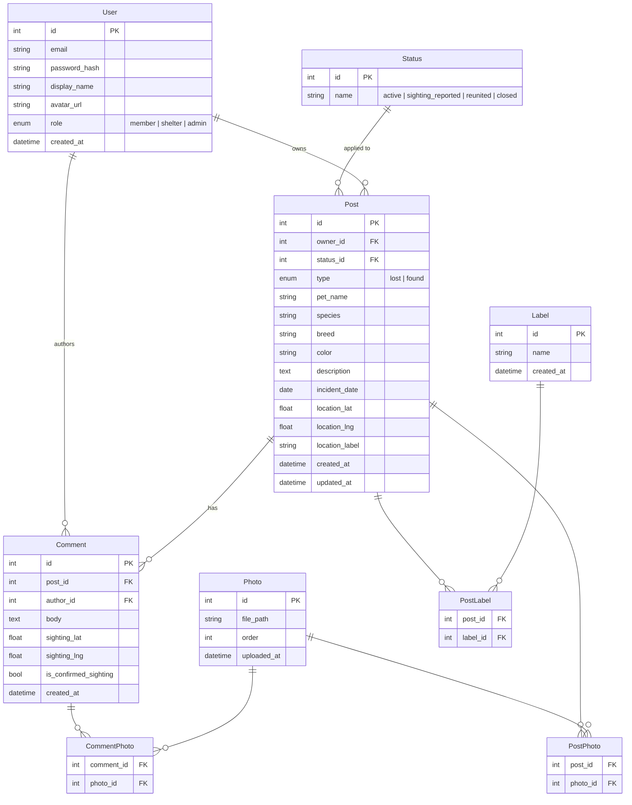

# PawWatch Clarksville — Entity Relationship Diagram

## Notes

- **Status** is a lookup table seeded with four rows: `active`, `sighting_reported`, `reunited`, `closed`. Post references it via `status_id`.
- **PostPhoto** and **CommentPhoto** are join tables connecting Photo to Post and Comment respectively. A photo belongs to either a post or a comment, never both.
- **role** on User is reserved for the shelter/rescue stretch goal. MVP only uses `member` and `admin`.
- `location_label` on Post is a human-readable address string (e.g. "Rossview Rd & Tiny Town Rd") stored alongside the coordinates for display.
- `sighting_lat` / `sighting_lng` on Comment are nullable — not every comment is a location-based sighting.
- `order` on Photo controls display order within a post or comment.
- **Label** is a predefined lookup table managed by admins. Seeded with: `Friendly`, `Shy / Timid`, `May Bite or Scratch`, `Good with Kids`, `Good with Other Pets`, `Needs Medication`, `Injured`, `Senior Pet`, `Deaf`, `Blind`, `Microchipped`, `Wearing Collar & Tags`, `Distinctive Markings`, `Neutered / Spayed`, `Reward Offered`, `Urgent`, `Near Busy Road`.
- **PostLabel** is a join table — a post can have many labels, a label can appear on many posts.
